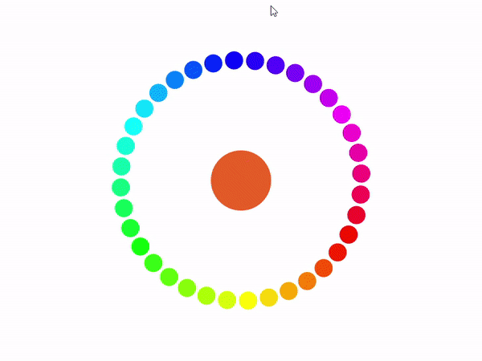

# Color-Circle
Assignment - Color Circle / Art & Technology(다)

## About Project...
 - 벽돌깨기 게임을 개발하며 색이 변화하는 공에 영감을 얻어 제작하게 되었습니다.
 - 회전하는 색상 공들을 눌러 색상 코드와 색조 값을 확인 할 수 있습니다.
 - 유동적인 프레임에 대응하기 위해 프레임별 시간 차이인 deltaTime를 구해서 사용했습니다.
 - `void setup`에서 `objCount`의 값을 변경하면 더욱 다양한 색을 확인할 수 있습니다.
 - 부드러운 에니메이션 효과를 위해 선형보간방법을 사용하였다.
   - Lerp(A, B, alpha) { A * (1 - Alpha) + B * Alpha}
 - 가운데 색상 공이 커질 때 주변 공 회전에 가속을 주는 효과를 추가해 ~~그럴싸하게~~ 만들었습니다.
 - 공의 중심과 마우스 커서와의 거리를 계산해 상호작용을 구현하였습니다. (dist < objRad...)

## Variable...
  - `maxRad` : 가운데 색상을 알려주는 공의 최대 반지름입니다.
  - `minRad` : 가운데 색상을 알려주는 공의 최소 반지름 입니다.
  - `maxDistance` : 주변을 돌아가는 공의 거리를 계산하기 위한 변수 입니다. (최대 반지름)
  - `minDistance` : 주변을 돌아가는 공의 거리를 계산하기 위한 변수 입니다. (최소 반지름)
  - `currentDistance` : 주변을 돌아가는 공의 거리를 계산하기 위한 변수 입니다. (현재 반지름)
  - `centerPosX` : 프로젝트의 중심점을 설정합니다.
  - `centerPosY` : 프로젝트의 중심점을 설정합니다.
  - `currentSpeed` : 프로젝트의 전체 속도를 설정합니다.
  - `clickedIndex` : 눌린 공의 인덱스 값을 저장합니다
  - `textPosX` : 텍스트의 현재 위치점 입니다.
  - `textPosY` : 텍스트의 현재 위치점 입니다.
  - `toTextPosX` : 텍스트 트랜지션의 끝점입니다.
  - `toTextPosY` : 텍스트 트랜지션의 끝점입니다.
  - `beginTextPosX` : 텍스트 트랜지션의 시작점입니다.
  - `beginTextPosY` : 텍스트 트랜지션의 시작점입니다.
  - `textAlpha` : 텍스트의 투명도를 설정합니다.
  - `currentTime` : 현재 프레임의 시간을 저장합니다.
  - `lastTime` : 이전 프레임의 시간을 저장합니다.
  - `deltaTime` : 이전 프레임과 현재 프레임 시간의 차이를 저장합니다.
  - `time` : 가운데 공의 색 변화를 위한 변수입니다.
  - `f` : 프로젝트의 전체 폰트입니다.